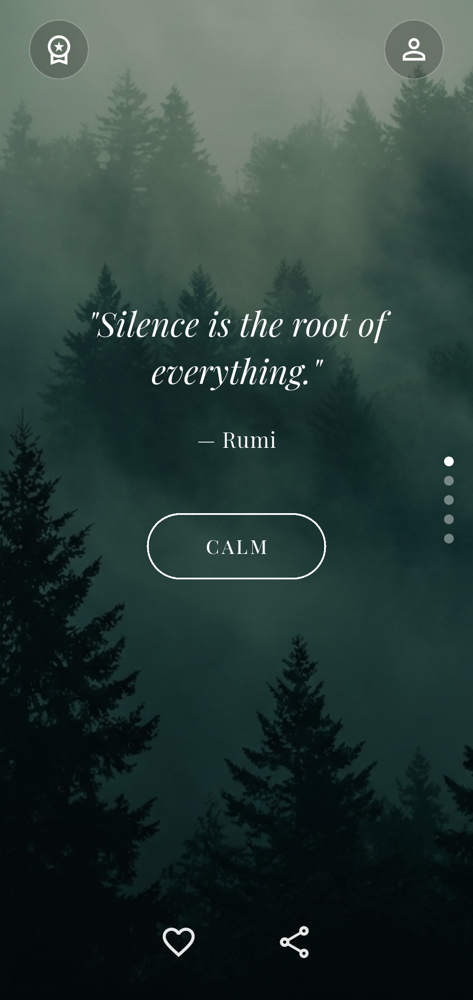
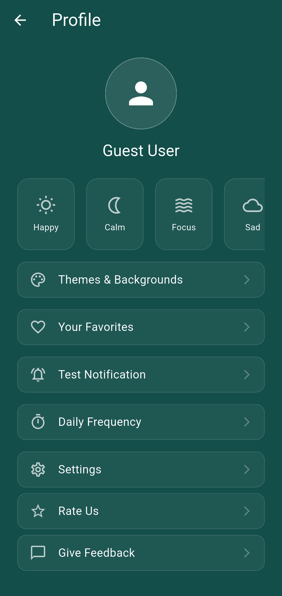
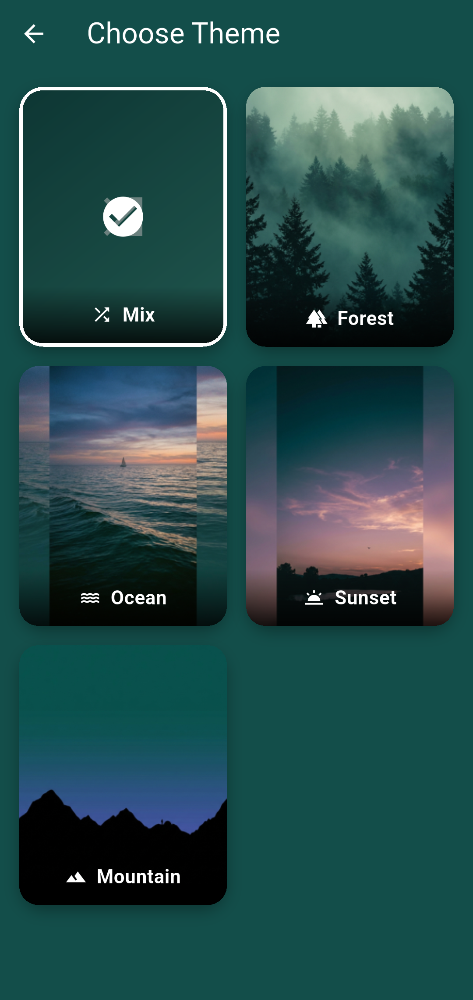
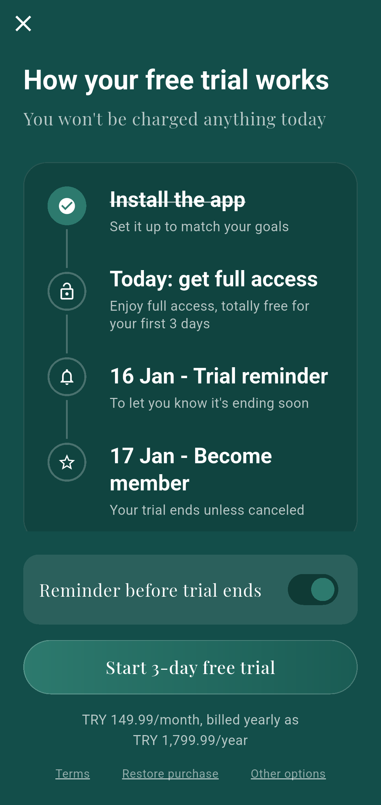
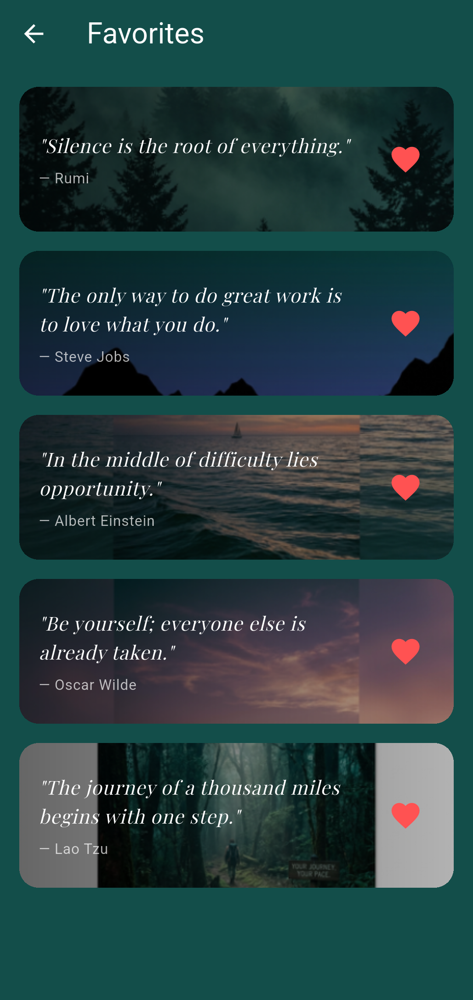
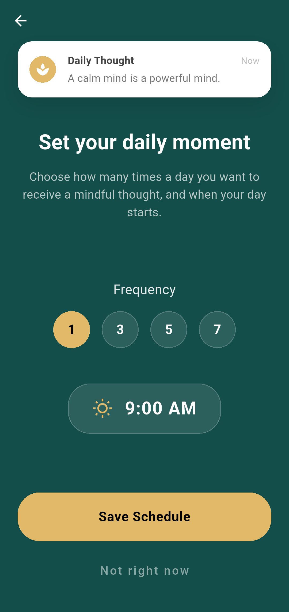

# Mindra - Daily Motivation & Affirmations 🌿

Start your day with positivity and mindfulness. Mindra provides daily motivational quotes, affirmations, and a serene experience to help you stay focused and calm.

## Features 🌟

*   **Daily Inspiration**: Swipe vertically through a curated collection of motivational quotes.
*   **Beautiful Themes**: Customize your experience with serene backgrounds (Forest, Ocean, Sunset, Mountain).
*   **Favorites**: Save your most cherished quotes to revisit them anytime.
*   **Smart Notifications**: Schedule daily reminders to pause and reflect.
    *   **Custom Frequency**: Choose how many times a day you want to be notified (1, 3, 5, or 7).
    *   **Smart Scheduling**: Notifications are automatically distributed throughout your day starting from your chosen time.
*   **Share Positivity**: Easily share quotes with friends and family.
*   **Premium Experience**: Unlock exclusive content and backgrounds.

## Screenshots 📸

| Home Screen | Themes | Favorites |
|:---:|:---:|:---:|
|  |  |  |

| Profile | Notification Settings | Premium |
|:---:|:---:|:---:|
|  |  |  |

## Tech Stack 🛠️

*   **Framework**: [Flutter](https://flutter.dev/)
*   **Language**: [Dart](https://dart.dev/)
*   **Local Storage**: `shared_preferences`
*   **Notifications**: `flutter_local_notifications`, `timezone`
*   **Fonts**: Google Fonts (`Playfair Display`, `Lato`)
*   **Design**: Custom UI with Immersive Mode and Glassmorphism effects.

## Getting Started 🚀

1.  **Clone the repository**
    ```bash
    git clone https://github.com/KnittyDev/Mindra.git
    ```

2.  **Install dependencies**
    ```bash
    flutter pub get
    ```

3.  **Run the app**
    ```bash
    flutter run
    ```
